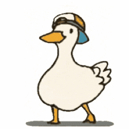

# Leftcoast Minimal

A minimal, markdown-focused Obsidian theme by Leftcoast.

## Install (manual)

Copy `theme.css` and `manifest.json` into your vault at:

```
<vault>/.obsidian/themes/Leftcoast Minimal/
```

Then enable **Leftcoast Minimal** under Settings → Appearance → Themes.

---

## Author

<p align="center">
  <a href="https://github.com/LeviathanDuck">
    
  </a>
</p>

<p align="center">
  Built by <a href="https://github.com/LeviathanDuck">Leviathan Duck</a> — Leftcoast Media House Inc.<br/>
  <a href="https://github.com/LeviathanDuck?tab=repositories">More Obsidian plugins &amp; themes</a>
</p>
